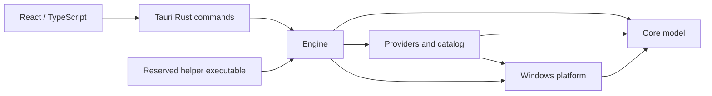
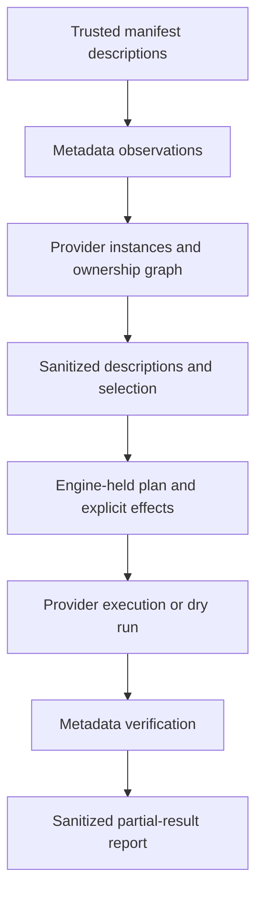

# EveryOut architecture overview

Phase 8 design, 2026-09-30. This is a target architecture, not an inventory of implemented
features. The current Cargo workspace contains only `src-tauri`; the proposed crates below
will be introduced in implementation phases. All examples are documentation, not code or schemas.

## Evidence and decision basis

- [Browser dossier](../research/01-browsers.md), sections 1, 4, 5 and 7: persistence spans
  profiles, partitions, database companions, identity and mixed-purpose stores.
- [Windows identity dossier](../research/02-windows-identity-and-multi-account.md), sections
  1–3 and 5–6: broker identity differs from app state; some credential APIs return secrets;
  optional other-user work needs a distinct system boundary.
- [Application dossier](../research/03-apps-detection-process-av.md), sections 1–3 and 6:
  framework signatures do not prove ownership or authentication, and discovery must be bounded.

The component boundaries are architectural decisions derived from those constraints, not claims
that the dossiers benchmarked this crate layout. Keep Tauri 2.x and React/TypeScript, with Rust
owning system operations, as recorded in [ADR 0002](../adr/0002-retain-tauri-rust-stack.md) and
[ADR 0003](../adr/0003-rust-command-capability-boundary.md).

## Design principle #1: delete and invalidate without reading secrets

EveryOut deletes and invalidates local session state but **never reads, copies, decrypts or
transmits secrets**. The wipe is local and offline. Detection of session-bearing artifacts uses
file/key existence, type and size metadata, never file contents, registry value payloads,
SQLite rows, LevelDB records, encrypted keys or credential blobs. A nonempty store means
possible persisted data, not an authenticated account.

Trusted bundled manifests are readable project configuration. OS-supplied package/process/profile
identity metadata is distinct from session content; retain only fields needed for ownership.
Potential reads of installation registry values, shortcut arguments, `profiles.ini`, browser
preferences or extension manifests are **not authorized by this design**. They remain the
`metadata-discovery-allowlist` open decision below. Missing coverage is reported as unknown rather
than bypassed by parsing a secret-bearing or mixed file. `CredEnumerateW` is excluded from inventory
because it returns credential blobs, even if the caller ignores them (Windows dossier, section 3).

All layers preserve the anti-cheat boundary: files, bounded registry operations, process
listing/closing and reviewed Windows account/credential interfaces only. No hooking, injection,
foreign-process memory access or drivers. An exception provider has the same boundary.
See Windows dossier section 6 and application dossier sections 1 and 6.

## Components and proposed workspace

| Location / crate                                        | Responsibility                                                                                                | Dependencies and boundary                                                                       |
| ------------------------------------------------------- | ------------------------------------------------------------------------------------------------------------- | ----------------------------------------------------------------------------------------------- |
| `crates/core-model` / `everyout-core-model`             | Provider IDs, categories, evidence, risks, plans, partial results and reports                                 | No Tauri or OS I/O; no secret-bearing types                                                     |
| `crates/platform-windows` / `everyout-platform-windows` | Bounded filesystem/registry metadata and deletion adapters; OS identity and process interfaces                | Core model; no generic file-content reader exposed to providers                                 |
| `crates/providers` / `everyout-providers`               | Manifest interpreter, curated catalog, provider contract, exceptional adapters such as a future Steam adapter | Core model and narrow platform interfaces; no engine dependency                                 |
| `crates/engine` / `everyout-engine`                     | Inventory aggregation, ownership resolution, selection validation, plan storage and result aggregation        | Core model, providers and platform; no UI dependency                                            |
| `src-tauri` / existing `everyout` package               | Tauri host and narrow Rust command bridge                                                                     | Engine; sends sanitized DTOs to React                                                           |
| `crates/elevated-helper` / `everyout-elevated-helper`   | Reserved separate executable boundary for approved other-user operations                                      | Core model, engine and platform; no React or Tauri dependency required                          |
| `src/`                                                  | React/TypeScript selection, plan review, progress and report presentation                                     | Calls named Rust commands using opaque IDs; no filesystem, shell or credential plugin authority |

This dependency graph is acyclic. Shared provider trait definitions belong in core model;
implementations belong in providers. Providers receive a platform interface, never direct UI
requests. The helper is a component reservation based on Windows dossier section 5; its permission,
UAC and IPC design belongs to Phase 9 and is not decided here.

## Data flow and ownership

These arrows describe data dependencies, not the wipe sequence reserved for Phase 9. Actual paths,
registry targets and OS user identifiers stay in Rust. UI input identifies an inventory snapshot,
provider instances and an engine-held plan; it cannot submit a replacement path or executable.
An execution plan records manifest revision, observation snapshot, owners, artifact families,
risks, limitations and required confirmations. Changed ownership or stale observations invalidate
the applicable plan rather than broadening its scope silently.

A provider is one application or browser; instances distinguish installations, OS users and
profiles. Accounts are expandable only where metadata can identify them without secrets. Shared
stores become explicit ownership edges, never two independent deletion requests. Classification
and selection follow [classification rules](04-classification-rules.md).

Reports distinguish operation success, metadata absence and authentication uncertainty. Local
absence cannot establish remote token revocation, full browser identity logout or durable SSO
logout (browser dossier sections 3–5; Windows dossier sections 1–2). Raw paths, usernames,
credential target strings and third-party command output do not enter exported reports.

## OPEN DECISIONS

Named spikes are future work identifiers; their definitions will be written in `docs/spikes/`
in a later phase. No spike file is added here. This is the central register for Phase 8.

| ID / named spike                   | Open question and required evidence                                                                                                                                                                                                      | Interim architectural behavior                                                                                                            |
| ---------------------------------- | ---------------------------------------------------------------------------------------------------------------------------------------------------------------------------------------------------------------------------------------- | ----------------------------------------------------------------------------------------------------------------------------------------- |
| `metadata-discovery-allowlist`     | Which installation registry/shortcut/config fields can be read safely, including relocated Firefox profiles and credential target metadata? Validate exact fields and `cmdkey` locale handling. Browser §7, Windows §3, applications §3. | Existence/size discovery plus reviewed OS identity metadata; no configuration-content exception; unresolved paths/accounts remain unknown |
| `browser-artifact-closure`         | Which release/channel artifact families provide session closure, including DBSC and Firefox identity mixed with preserved stores? Browser §§1, 4–5.                                                                                      | Candidate rules cannot claim complete logout; mixed stores blocked                                                                        |
| `app-session-scope`                | Which per-app rules and exceptional Steam operations are secret-free, offline and preserve unrelated data? Applications §§1, 7; Windows §4.                                                                                              | Framework detection does not create an executable cleaning rule; unsupported providers report no plan                                     |
| `heuristic-confidence-calibration` | Validate independent signals, score thresholds and bounded discovery coverage against labeled installations/residue/fixtures. Applications §§1, 3 and open questions.                                                                    | Scores are provisional policy bands, not probabilities; only high-confidence heuristic detections pre-selected                            |
| `pwa-shared-store-ownership`       | Establish metadata-only PWA enumeration and exclusive/shared UDF ownership across wrappers, profiles and origins. Applications §2.                                                                                                       | Browser-owned PWA aliases share their browser target; unresolved overlaps block affected actions                                          |
| `extension-preservation-boundary`  | Identify versioned wallet/vault/2FA risks and whether exclusions can isolate them in shared stores. Browser §6; applications §7.                                                                                                         | Known risks flagged; unknown mixed storage cannot be treated as harmless                                                                  |
| `metadata-av-compatibility`        | Measure metadata and deletion behavior with actual AV/EDR releases; obtain vendor evidence for blocks. Applications §6.                                                                                                                  | No immunity claim or protection bypass; blocks reported explicitly                                                                        |
| `tauri-command-acl-validation`     | Validate app-command permission generation and scope enforcement against the locked Tauri version. ADR 0003 and official Tauri docs.                                                                                                     | Proposed bridge remains unimplemented; placeholder grants no system-plugin permissions                                                    |

Permission/UAC design, wipe sequencing, sync handling and broader V2 design belong to Phase 9.
Threat modeling, test strategy and catalog updates belong to Phase 10. This phase defines the
component and provider boundaries without filling in those later designs.
