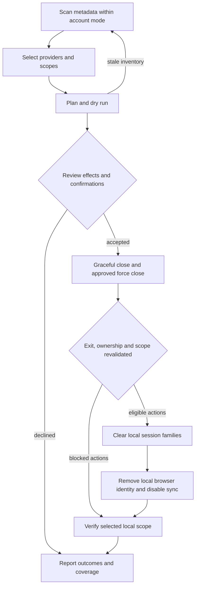

# One local wipe

Phase 9 target design for EveryOut. No behavior described here is implemented by this phase.
V1 clears local session persistence offline; it never reads, copies, decrypts or sends secrets.
The engine uses the existing [provider contract](01-provider-contract.md),
[manifest operations](02-manifest-spec.md) and [classification rules](04-classification-rules.md).
Candidate support remains non-executable. This sequence does not expand the contract.

## Sequence and review gates

The graph is per dependency group: independent eligible groups may proceed when another fails.
An action with a failed prerequisite is blocked; a browser identity step must not be lost merely
because a cookie action failed if its own prerequisites still hold. Browser processes stay closed
from closing through verification. No automatic browser/app restart follows a wipe.

1. **Scan:** call `detect` and `describe` for metadata inventory, owners, profile scopes, risks and
   coverage gaps. Presence means possible persisted state, never proven authentication. Discovery
   rules remain those of [03](03-heuristic-detection.md), not a new recursive search policy.
2. **Selection:** apply the existing defaults: resolved detections checked, medium/low heuristic
   candidates separately unchecked. Expand user/profile scopes where safe metadata permits.
   Resolve aliases and shared stores before planning; do not infer another category's selection.
3. **Dry run:** `plan` fixes targets, manifest revisions, scope, shared effects and blockers;
   `execute(dryRun)` revalidates metadata without closing processes, editing preferences, deleting
   data or invoking local logout operations. Preview process effects, identity/sync coverage and
   irreversible losses. Deletion verification is `NotPerformed`, never a simulated success.
4. **Review:** bind approval and required extra confirmations to that exact plan. Declined gates
   block affected actions. A changed mode, target, owner, revision or effect needs a fresh review.
5. **Close:** apply the policy below only to selected, identity-checked processes. Recheck actual
   exit, resource release and ownership before mutation; a lockfile's absence alone is insufficient.
6. **Clean:** execute supported local artifact families, including validated companions, once per
   physical target. Cookies, localStorage, sessionStorage, IndexedDB, service workers, local tokens
   and extension session data are candidates within reviewed scope, not permission to delete a
   whole profile. Mixed stores and preservation conflicts stay blocked.
7. **Browser identity and sync:** perform only validated local identity removals and the adopted
   closed-profile sync edits described in [07](07-sync-and-identity.md). General cleaning must
   preserve configuration needed by this step. Unsupported edits leave explicit incomplete coverage.
8. **Verify:** call `verify` on planned targets, including failed/blocked groups where observation
   is safe. Keep execution outcomes separate from current metadata observations.
9. **Report:** aggregate sanitized action and verification results through `report`. Keep results
   for completed mutations even after cancellation or a later error; no rollback is promised.

This ordering adopts the requested workflow. Its safety basis is browser research §§1–7,
[application research §5](../research/03-apps-detection-process-av.md#5-process-closing-and-unsaved-work)
and [Windows research §§2–5](../research/02-windows-identity-and-multi-account.md).
Closed processes prevent ordinary live writes during the local steps; durable logout after a
restart is not established by that ordering.

## Process-closing setting

Default **ask**: request graceful closure first, then show remaining selected processes and ask
the user to save work and retry, skip the dependent targets, cancel, or explicitly force close
the named processes. There is no automatic force escalation in this mode. A declined force request
keeps dependent targets blocked and retains earlier outcomes.

Optional **hard kill after 2 seconds**: first show and require acknowledgment of this warning:
**Force closing can destroy unsaved work in other programs, interrupt uploads or drafts, and leave
data inconsistent. Two seconds does not make termination safe.** Bind the acknowledgment to the
setting and show the actual process set again in plan review; new affected owners require review.
Request graceful closure, start the engine's two-second grace interval for each close group, and
then force only surviving approved processes. Wait for actual exit and recheck resources before
cleaning. A failed termination or continuing lock blocks dependent mutations.

Use Restart Manager resource discovery and an appropriate graceful shutdown request or `WM_CLOSE`
for reviewed targets. Resource users are evidence, not automatic members of the close set.
Do not close unrelated services, all processes sharing an image name, or every WebView2 process.
Restart Manager's forced shutdown timeout is not two seconds; the two-second mode is an EveryOut
policy implemented separately, pending `process-close-coordination`. PID reuse, child ownership,
relaunch and interference with a blocking shutdown call need validation before implementation.
See application research §5. No hooking, injection, foreign-memory reads or drivers are allowed
([overview](00-overview.md), application research §6).

## Account variants and confirmations

**Current account:** normal unelevated engine, invoking user's selected app/browser profiles and
supported local developer targets. Access denied stays a failure; it never triggers UAC.

**All accounts:** first obtain the optional helper as defined in [06](06-permission-model.md),
then scan and review eligible user scopes. Show exclusions for inaccessible, special or loaded
other-user profiles. UAC is not per-profile consent and does not permit killing another user's
running apps. V1 skips other loaded profiles and cross-session closing; report this limitation.
The invoking user's scope can proceed normally. UAC refusal returns to current-account mode with
a new inventory/review, never silent execution of a reduced version of the old plan.
These eligibility decisions follow Windows research §5's conservative recommendation.

Risk flags in [02](02-manifest-spec.md) require provider/profile-specific extra confirmation for
known supported losses such as local-only documents, drafts, settings, wallet/key material or
vault/2FA recovery data. The Windows/Microsoft + developer-tools category has a separate gate;
both gates apply when both risks occur. Saved passwords, autofill, history and passkeys stay
excluded: confirmation cannot waive preservation, unknown ownership or unsupported operations.
Shared-store effects must include every affected selected owner, as required by [04](04-classification-rules.md).

## Failure handling

| Failure                                                             | Behavior                                                                                                                        |
| ------------------------------------------------------------------- | ------------------------------------------------------------------------------------------------------------------------------- |
| Stale plan, changed owner or manifest                               | Block affected group; rescan and review before retry; never substitute broader paths                                            |
| Graceful close declined, process survives or relaunches             | Skip dependent mutations; record blocked/locked coverage; continue independent groups                                           |
| Force kill fails or exit cannot be established                      | Keep dependent data untouched; record failure and unknown liveness                                                              |
| Access denied or security-product block                             | Record stable error and sanitized OS code; no privilege escalation in current mode or protection bypass                         |
| One file/companion removal fails                                    | Retain earlier `Applied` outcomes, verify the whole planned family, report partial effects                                      |
| Unsupported identity/sync edit, mixed store or unknown DBSC closure | Block that action; retain independent supported cleanup but report incomplete browser coverage                                  |
| UAC declined or helper unavailable                                  | No other-user work; explain fallback and rebuild current-account inventory/plan                                                 |
| Helper disconnects during mutation                                  | Preserve received results, mark unacknowledged actions unknown, re-observe eligible targets before retry                        |
| Cancellation                                                        | Stop scheduling new mutations; account for any in-flight result, verify safe targets and report cancellation with prior effects |
| Verification denied, target present or target recreated             | Record `Inaccessible`, `TargetPresent` or `Unknown`; no complete local-scope claim                                              |

No error path reads database rows, credential blobs or arbitrary CLI output to recover information.
This applies the partial-result semantics of [01](01-provider-contract.md) and the AV/EDR
constraints of application research §6.

## Verification and three independent reports

Use `TargetAbsent`, `TargetPresent`, `Inaccessible`, `Unknown` and `NotPerformed` as defined in
[01](01-provider-contract.md). An empty database is not proof of no sessions. A zero exit code is
an operation outcome, not absence. For validated configuration edits, any non-secret field check
requires the separately approved allowlist; otherwise configuration effect is `Unknown`.

DBSC makes cookie-only absence insufficient: surviving session records or browser-managed key
references may refresh cookies. Cover validated DBSC persistence and companions separately;
unresolved key-reference coverage prevents a complete browser-session coverage claim. Do not
delete TPM-wide keys or passkeys. Metadata cannot prove key destruction, failed refresh or server
logout. Restart/expiry/refresh evidence belongs to the named `browser-artifact-closure` spike,
not to a live network probe in the wipe. See
[browser research §4](../research/01-browsers.md#4-device-bound-session-credentials).

Always show three report sections: **applications**, **browsers**, and
**Windows/Microsoft + developer-tools**. Each lists selected user/profile scopes, shared effects,
action outcomes, verification, excluded/unsupported coverage and remaining uncertainty. A browser
PWA alias receives its browser-owned result without inventing a second cleanup. App success never
implies browser success; browser success never implies Windows/broker/developer cleanup.
Unselected categories say not requested, rather than successful. No category implies Windows
account sign-out. Neutral opaque labels replace raw paths, usernames and credential targets.

Aggregate states retain the contract's complete-local-scope, partial, blocked/failed, cancelled
and dry-run meanings. “Complete local scope” refers only to planned supported targets, with all
coverage exclusions visible; it must never become “all accounts logged out” or “remote revoked”.
Browser identity, sync and silent SSO uncertainty remain separate from website-store observations.

## Idempotence argument

For a stable manifest and selected scope, deleting an already absent validated family is
`AlreadyAbsent`; absence is reverified without creating directories or session stores. A validated
sync edit must set a fixed disabled state, not toggle it, and already-disabled state is a no-op.
Deduplication prevents shared stores from being mutated twice. A new run creates a fresh snapshot
and never reuses stale confirmations or assumes previous errors disappeared.

After a complete run, with no app restart, sync restoration, SSO or external writes, a second run
reports **nothing left in the supported local scope**, `AlreadyAbsent`/no-op outcomes and the same
coverage limitations. After a partial run it retries only still-eligible effects under fresh review;
unknown effects stay unknown. If data is recreated, the second run honestly reports new remaining
targets. Idempotence is conditional on quiescence and validated methods, not a durable logout claim.
See browser research §§3–4 and the provider contract's already-absent and partial-result semantics.

## OPEN DECISIONS

- `process-close-coordination`: validate graceful API selection, two-second coordination,
  termination waits, PID identity, helper ownership and relaunch handling; block unvalidated close paths.
- Existing `browser-artifact-closure`, `app-session-scope`, `pwa-shared-store-ownership` and
  `extension-preservation-boundary`: validate action closure and preservation as registered in
  [00](00-overview.md#open-decisions); no executable candidate fallback.
- Permission and sync spikes are listed in [06](06-permission-model.md#open-decisions) and
  [07](07-sync-and-identity.md#open-decisions); their unresolved actions remain blocked.
